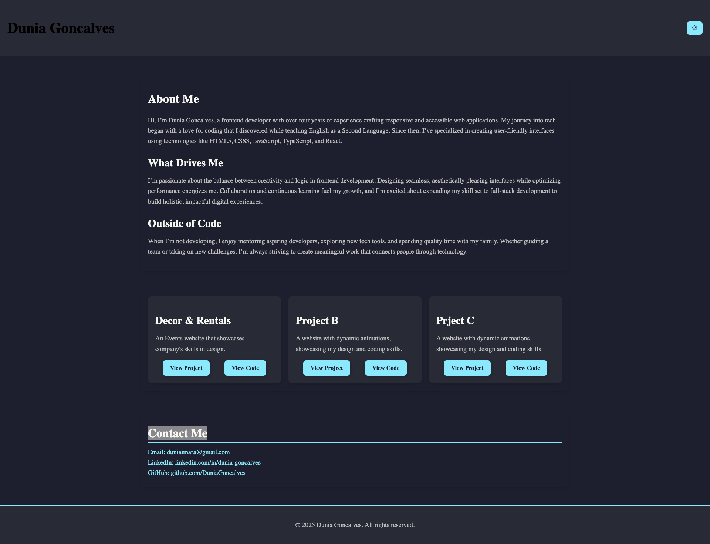

# 🌐 Light/Dark Theme Portfolio Website

**A sleek and responsive portfolio website built with React.**  
This website focuses on responsive, accessible web applications. The site features a light and dark theme toggle and provides details about my skills, projects, and contact information.

## 🚀 Features

- **Responsive Design:** Responsive with smooth responsiveness on all devices.
- **Light/Dark Mode** Toggle between light and dark themes for better user experience.

## ⚙️ Technologies Used

- **Frontend**: React, HTML, CSS
- **Styling**: Styled-components for writing CSS in JavaScript and theming

## 📸 Screenshots

#### React + Vite

This template provides a minimal setup to get React working in Vite with HMR and some ESLint rules.

Currently, two official plugins are available:

- [@vitejs/plugin-react](https://github.com/vitejs/vite-plugin-react/blob/main/packages/plugin-react/README.md) uses [Babel](https://babeljs.io/) for Fast Refresh
- [@vitejs/plugin-react-swc](https://github.com/vitejs/vite-plugin-react-swc) uses [SWC](https://swc.rs/) for Fast Refresh
